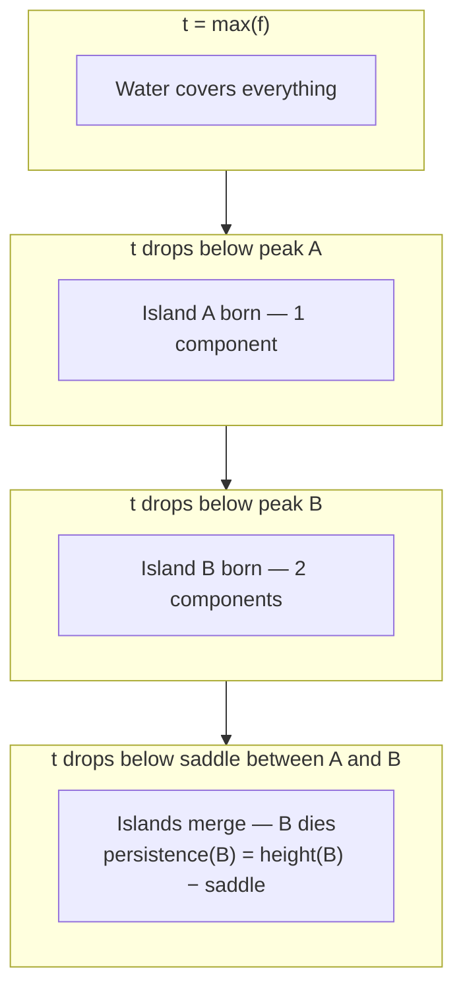
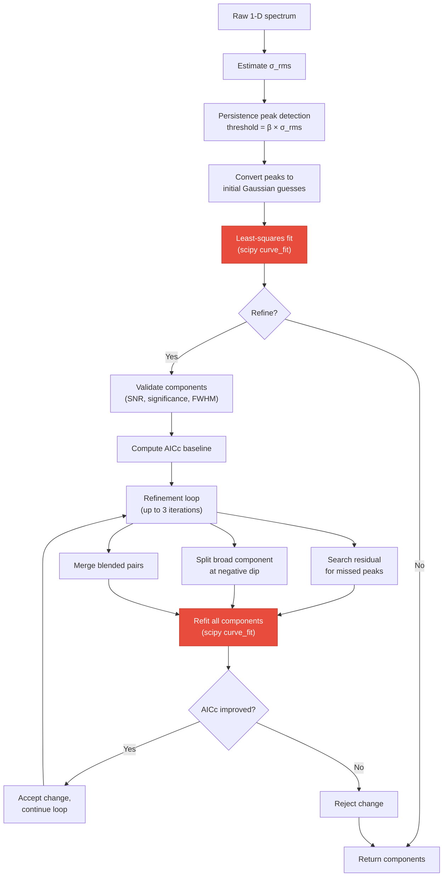

# Persistent Homology

A detailed look at 0-dimensional persistent homology for 1D signals and how phspectra uses it to decompose spectra into Gaussian components.

## Mathematical foundation

### Upper-level sets and connected components

Given a 1D signal $f : \{0, 1, \ldots, n-1\} \to \mathbb{R}$, the **upper-level set** at threshold $t$ is

$$
U_t = \{ i \mid f(i) \geq t \}
$$

As $t$ decreases from $\max(f)$ toward $-\infty$, the topology of $U_t$ changes:

- **Birth**: when $t$ drops below a local maximum $f(i)$, a new connected component appears. We say the component is **born** at value $f(i)$.
- **Death**: when $t$ drops enough that two components merge, the **younger** component (the one whose maximum is lower) **dies** at that threshold. The elder component absorbs it.

This is **0-dimensional persistent homology** ($H_0$): we track connected components (dimension 0) across a filtration parameterized by $t$.

### Birth-death pairs and persistence

Each local maximum except the global one produces a pair $(b, d)$ where:

- $b = f(i)$ is the **birth** value (peak height)
- $d$ is the **death** value (threshold at which it merges into an older component)
- **Persistence** $\pi = b - d$ quantifies how prominent the peak is

The global maximum never merges into anything — it has $d = 0$ and persistence equal to its height.

**Key property**: persistence provides a scale-independent ranking of peaks. High-persistence peaks correspond to real features; low-persistence peaks are noise fluctuations. No smoothing or derivative is needed.

### Complexity

For a 1D signal of length $n$, the algorithm sorts indices by decreasing value ($O(n \log n)$) and processes each with a union-find structure (amortized $O(\alpha(n))$ per operation). Total complexity is $O(n \log n)$.

## Visual intuition

### The descending water level

Think of the signal as a mountain range seen from the side, with water starting above all peaks. As the water drains:

<!-- TODO: add a figure showing a sample spectrum with the water level at several thresholds,
     annotating birth/death events and the resulting persistence values for each peak. -->

### The persistence diagram

Each peak maps to a point $(b, d)$ in a 2D plane. The diagonal $b = d$ represents zero persistence (pure noise). Points far from the diagonal are significant peaks.

<!-- TODO: add a persistence diagram figure for a real GRS spectrum,
     coloring points above and below the β·σ threshold differently. -->

## The algorithm in phspectra

The implementation lives in `persistence.py` and follows the union-find approach described above. Here is the full pipeline from raw spectrum to fitted Gaussians:

Red nodes mark the computational bottlenecks. Both are `scipy.optimize.curve_fit` calls — the initial fit runs once, but the refinement refit can be called up to three times per iteration (once per refinement operation: residual search, dip split, blended merge), each triggering a full nonlinear least-squares solve over all components.

### Step 1: Noise estimation

Before detecting peaks, phspectra estimates $\sigma_{\rm rms}$ using a signal-masked approach (Riener et al. 2019, Sect 3.1.1):

1. **Mask signal regions** — runs of $> 2$ consecutive positive channels are masked (with 2-channel padding on each side) to exclude spectral features.
2. **MAD from negative channels** — the median absolute deviation of the remaining negative channels gives an initial robust scale estimate.
3. **Clip outliers** — channels exceeding $\pm 5\sigma_{\rm MAD}$ are masked.
4. **Final RMS** — $\sigma_{\rm rms} = \sqrt{\mathrm{mean}(x^2)}$ over surviving channels.

This is more robust than a simple MAD of the full signal because it avoids biasing the noise estimate with actual spectral features.

### Step 2: Persistence peak detection

Peaks are detected using 0-dimensional persistent homology with a minimum persistence threshold:

$$
\pi_{\min} = \beta \times \sigma_{\rm rms}
$$

where $\beta = 4.0$ is the default (the sole free parameter). The algorithm:

1. Sort all channel indices by decreasing signal value.
2. Process each index: mark it visited, check if its left/right neighbors are already visited.
3. If a neighbor belongs to an existing component, merge via union-find. The younger component (lower peak) dies at the current signal value.
4. Record any peak whose persistence $\pi = b - d > \pi_{\min}$.
5. The global maximum is always recorded (it never dies).

Peaks are returned sorted by persistence, most significant first.

### Step 3: Initial Gaussian fit

Each detected peak becomes an initial guess for a Gaussian component:

| Parameter | Initial value |
| --------- | ------------- |
| Amplitude | Signal value at peak index |
| Mean | Peak channel index |
| Std. dev. | 1.0 (channels) |

These are fitted simultaneously as a sum of Gaussians via `scipy.optimize.curve_fit` with bounds (amplitude $\geq 0$, mean within spectrum, std. dev. $\in [0.3, n/2]$).

### Step 4: Iterative refinement

When `refine=True` (default), the fit is iteratively improved. Each step is accepted only if it lowers the corrected Akaike Information Criterion (AICc):

$$
\mathrm{AICc} = N \ln\!\left(\frac{\mathrm{RSS}}{N}\right) + 2k + \frac{2k^2 + 2k}{N - k - 1}
$$

where $k = 3 \times$ (number of components) and $N$ is the number of channels.

The refinement loop (up to 3 iterations) performs three operations per iteration:

**a) Component validation** — reject components that fail any of:
- FWHM $< 1$ channel
- Mean outside spectrum bounds
- Amplitude $< 1.5 \times \sigma_{\rm rms}$ (SNR floor)
- Significance $< 4.0$, where significance is defined as $W_i / (\sqrt{2 \cdot \mathrm{FWHM}_i} \cdot \sigma_{\rm rms})$ and $W_i = a_i \cdot \sigma_i \cdot \sqrt{2\pi}$ is the integrated flux

**b) Residual peak search** — run persistence detection on the residual (data minus model) to find missed components, using a lower threshold of $1.5 \times \sigma_{\rm rms}$.

**c) Negative dip splitting** — if the residual has a dip below $-5 \times \sigma_{\rm rms}$, the broadest overlapping component is split into two narrower Gaussians.

**d) Blended pair merging** — if two components are separated by less than $1.2 \times \min(\mathrm{FWHM}_i, \mathrm{FWHM}_j)$, they are merged into a single flux-weighted component.

### Why this works for spectra

Radio-astronomical spectra are superpositions of Gaussian emission lines sitting on a noisy baseline. Persistent homology is well-suited because:

1. **No smoothing needed** — derivatives require choosing a kernel width; persistence works directly on the raw signal.
2. **Multi-scale by construction** — broad and narrow features are detected simultaneously, ranked by the same persistence measure.
3. **Single parameter** — $\beta$ controls the noise/signal boundary in physically meaningful units ($\sigma$), unlike GaussPy's $\alpha_1$, $\alpha_2$ which must be trained per survey.
4. **Robust to noise** — the signal-masked RMS estimation and persistence ranking naturally separate noise fluctuations from real components without explicit SNR heuristics at the detection stage.
