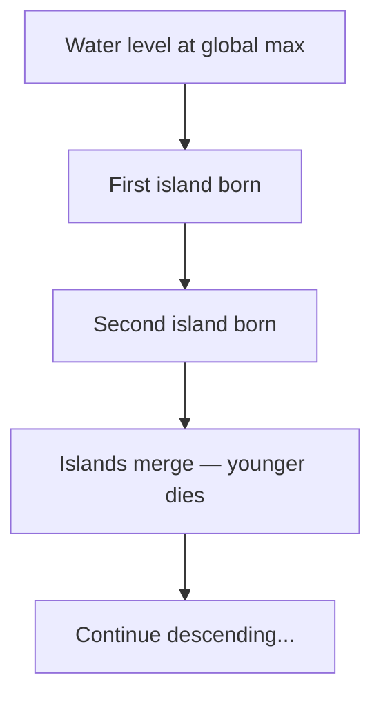

# Persistent Homology Primer

A brief introduction to 0-dimensional persistent homology for 1D signals — the mathematical foundation of our peak detection algorithm.

## The "descending water level" metaphor

Imagine a 1D function as a landscape and picture a water level that starts above the highest peak and slowly descends:

1. **Birth**: When the water level drops below a local maximum, a new "island" (connected component) appears. We say the component is **born** at this function value.
2. **Merge**: When the water level drops enough that two islands connect, the **younger** island (the one with the lower peak) is absorbed into the older one. The younger component **dies** at this merge level.
3. **Persistence**: The lifetime of a component is `birth - death`. This quantity is called its **persistence**.

## Birth-death pairs

Each peak (except the global maximum) produces a **(birth, death)** pair:

- **Birth** = the height of the local maximum
- **Death** = the height at which this peak's component merges into an older one

The global maximum never dies — it has infinite persistence.

## The persistence diagram

A **persistence diagram** plots each peak as a point `(birth, death)` in a 2D plane. Points far from the diagonal `birth = death` represent significant features; points near the diagonal are noise.

For spectral line decomposition:

- **High persistence** = real emission component
- **Low persistence** = noise fluctuation

This gives us a natural, parameter-free way to separate signal from noise.

## Why 0-dimensional?

Persistent homology can track topological features of any dimension:

- **H0** (dimension 0): connected components — i.e., peaks
- **H1** (dimension 1): loops/holes
- **H2** (dimension 2): voids

For 1D signals, only H0 is relevant. The algorithm is simple and runs in $O(n \log n)$ time.

## From peaks to Gaussians

Once we have the persistence-ranked peaks, we use them as initial guesses for a Gaussian mixture fit:

1. Select peaks above a persistence threshold (or take the top-k).
2. Use each peak's position and height as initial guess for amplitude and mean.
3. Fit a sum of Gaussians using least-squares optimisation (`scipy.optimize.curve_fit`).

The persistence provides an excellent initial guess because it directly measures how "prominent" each peak is in the original signal.
