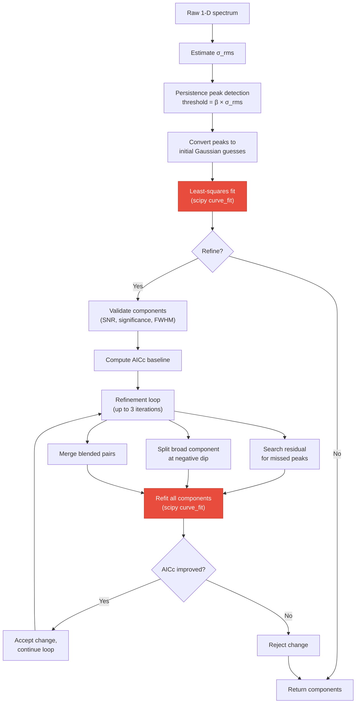

# Persistent Homology

A detailed look at 0-dimensional persistent homology for 1D signals and how phspectra uses it to decompose spectra into Gaussian components.

## Mathematical foundation

### Upper-level sets and connected components

Given a 1D signal $f : \{0, 1, \ldots, n-1\} \to \mathbb{R}$, the **upper-level set** at threshold $t$ is

$$
U_t = \{ i \mid f(i) \geq t \}
$$

As $t$ decreases from $\max(f)$ toward $-\infty$, the topology of $U_t$ changes:

- **Birth**: when $t$ drops below a local maximum $f(i)$, a new connected component appears. We say the component is **born** at value $f(i)$.
- **Death**: when $t$ drops enough that two components merge, the **younger** component (the one whose maximum is lower) **dies** at that threshold. The elder component absorbs it.

This is **0-dimensional persistent homology** ($H_0$): we track connected components (dimension 0) across a filtration parameterized by $t$.

### Birth-death pairs and persistence

Each local maximum except the global one produces a pair $(b, d)$ where:

- $b = f(i)$ is the **birth** value (peak height)
- $d$ is the **death** value (threshold at which it merges into an older component)
- **Persistence** $\pi = b - d$ quantifies how prominent the peak is

The global maximum never merges into anything — it has $d = 0$ and persistence equal to its height.

**Key property**: persistence provides a scale-independent ranking of peaks. High-persistence peaks correspond to real features; low-persistence peaks are noise fluctuations. No smoothing or derivative is needed.

### Complexity

For a 1D signal of length $n$, the algorithm sorts indices by decreasing value ($O(n \log n)$) and processes each with a union-find structure (amortized $O(\alpha(n))$ per operation). Total complexity is $O(n \log n)$.

## Visual intuition

### The descending water level

Think of the signal as a mountain range seen from the side, with water starting above all peaks. As the water drains:

The figure below shows this process on a synthetic three-peak spectrum (the same kind of signal phspectra is designed to decompose). The blue shaded region represents the water, and the dashed line marks the current threshold $t$. Red dots appear at the moment a peak is born, annotated with its final persistence $\pi$.

Walk through the four panels left-to-right, top-to-bottom:

1. **Top-left — $t$ above all peaks.** The water covers the entire signal. No part of the curve pokes above the surface, so the upper-level set $U_t$ is empty. There are zero connected components and nothing has been born yet.

2. **Top-right — $t$ just below peak A.** The water drops past the tallest peak (channel 60, amplitude $\approx 2.5$). A single island emerges: connected component A is **born** at $b_A = f(60)$. Because A is the global maximum it will never merge into anything else — its persistence equals its full height. The annotation $\pi = 2.58$ reflects this: it is the most significant feature in the signal by a wide margin.

3. **Bottom-left — $t$ just below peak B.** The water continues to descend and now drops past the second-tallest peak (channel 100, amplitude $\approx 1.4$). A second island appears: component B is **born** at $b_B = f(100)$. At this moment two disconnected islands coexist. Peak C (channel 140) is still submerged. Note that both born peaks already carry their final persistence annotations — persistence is determined entirely by when a peak is born and when it eventually dies, not by the current water level.

4. **Bottom-right — $t$ below the saddle between A and C.** The water has dropped far enough that the valley between peaks A and C fills in and their islands connect. Because C has a lower maximum than A, C is the **younger** component: it **dies** at the merge threshold. Its persistence $\pi_C = b_C - d_C = 0.73$ measures the height difference between its peak and the saddle where it was absorbed. Meanwhile peak B, sitting in a separate valley, remains an independent island with $\pi_B = 1.20$. The algorithm continues until only one component (the global maximum) survives.

The key insight is that **persistence directly encodes significance**: peak A ($\pi = 2.58$) is clearly the dominant feature, peak B ($\pi = 1.20$) is a solid secondary detection, and peak C ($\pi = 0.73$) is weaker but still well above the noise floor. Noise fluctuations, by contrast, produce tiny islands that merge almost immediately, resulting in persistence values close to zero. Setting a threshold $\pi_{\min} = \beta \times \sigma_{\rm rms}$ cleanly separates real peaks from noise without any smoothing or derivative computation.

### The persistence diagram

The persistence diagram provides a compact summary of every birth-death event in the filtration. Each peak is plotted as a point $(b, d)$ where $b$ is the birth value (peak height) and $d$ is the death value (merge threshold). The diagonal line $b = d$ represents zero persistence — a peak born and immediately killed. The farther a point sits from the diagonal, the more significant the peak.

In this diagram, the three real peaks (red points) are clearly separated from the cluster of grey noise points hugging the diagonal. This visual separation is what makes persistence-based peak detection so effective: there is no ambiguous boundary between signal and noise, just a clear gap in persistence space. Any horizontal line drawn through this gap (i.e., a persistence threshold $\pi_{\min}$) will cleanly select the real peaks and reject the noise, and the exact position of that line is not critical — the result is stable across a wide range of thresholds.

This is the fundamental advantage over derivative-based methods: instead of relying on a smoothing kernel to suppress noise (where too little smoothing creates false peaks and too much destroys real ones), persistence ranks every candidate peak by an intrinsic topological measure that is robust to the noise level.

### From persistence to Gaussian candidates

The persistence filtration produces a list of `PersistentPeak` objects, each carrying four pieces of information: the **channel index** of the local maximum, its **birth** value (peak height), its **death** value (merge threshold), and its **persistence** ($\pi = b - d$). This is the raw output of the topology — but these are not yet Gaussian fits. The next step is to convert them into initial guesses that a nonlinear least-squares solver can refine.

The conversion is deliberately simple. For each peak that survives the persistence threshold $\pi_{\min} = \beta \times \sigma_{\rm rms}$:

1. **Amplitude** is set to the signal value at the peak's channel index: $a_0 = f(\text{index})$. This is the actual measured height at that position, not the birth value (which is the same for non-noise peaks, but using the signal directly avoids edge cases).

2. **Mean** (center position) is set to the peak's channel index itself. The persistence algorithm identifies exactly which sample is the local maximum, so no interpolation is needed — the index is already the best discrete estimate of the peak location.

3. **Standard deviation** is initialized to a fixed value of $\sigma_0 = 1.0$ channel. This is intentionally naive: the persistence filtration tells us *where* peaks are and *how significant* they are, but it says nothing about their width. The width information will be recovered entirely by the least-squares fit in the next stage.

The peaks are ordered by persistence (most significant first), so if a `max_components` cap is set, the least significant surviving peaks are dropped. This ordering also means the solver starts with the strongest features anchored in place, which improves convergence.

This initial guess is then passed to `scipy.optimize.curve_fit`, which fits a sum of Gaussians to the full signal:

$$
F(x, \mathbf{a}, \mathbf{\mu}, \mathbf{\sigma}) = \sum_i a_i \exp\!\bigl(-\tfrac{1}{2}\bigl(\tfrac{x - \mu_i}{\sigma_i}\bigr)^2\bigr).
$$

The solver adjusts all three parameters per component simultaneously (with bounds: $a \geq 0$, $\mu \in [0, n)$, $\sigma \in [0.3, n/2]$). Because the initial positions and amplitudes are already close to the truth — persistence detected the right peaks — the fit typically converges in few iterations, and the solver's main job is to determine the correct widths and fine-tune the positions and amplitudes.

## The algorithm in phspectra

The implementation lives in `persistence.py` and follows the union-find approach described above. Here is the full pipeline from raw spectrum to fitted Gaussians:

Red nodes mark the computational bottlenecks. Both are `scipy.optimize.curve_fit` calls — the initial fit runs once, but the refinement refit can be called up to three times per iteration (once per refinement operation: residual search, dip split, blended merge), each triggering a full nonlinear least-squares solve over all components.

### Step 1: Noise estimation

Before detecting peaks, phspectra estimates $\sigma_{\rm rms}$ using a signal-masked approach (Riener et al. 2019, Sect 3.1.1):

1. **Mask signal regions** — runs of $> 2$ consecutive positive channels are masked (with 2-channel padding on each side) to exclude spectral features.
2. **MAD from negative channels** — the median absolute deviation of the remaining negative channels gives an initial robust scale estimate.
3. **Clip outliers** — channels exceeding $\pm 5\sigma_{\rm MAD}$ are masked.
4. **Final RMS** — $\sigma_{\rm rms} = \sqrt{\mathrm{mean}(x^2)}$ over surviving channels.

This is more robust than a simple MAD of the full signal because it avoids biasing the noise estimate with actual spectral features.

### Step 2: Persistence peak detection

Peaks are detected using 0-dimensional persistent homology with a minimum persistence threshold:

$$
\pi_{\min} = \beta \times \sigma_{\rm rms}
$$

where $\beta = 4.0$ is the default (the sole free parameter). The algorithm:

1. Sort all channel indices by decreasing signal value.
2. Process each index: mark it visited, check if its left/right neighbors are already visited.
3. If a neighbor belongs to an existing component, merge via union-find. The younger component (lower peak) dies at the current signal value.
4. Record any peak whose persistence $\pi = b - d > \pi_{\min}$.
5. The global maximum is always recorded (it never dies).

Peaks are returned sorted by persistence, most significant first.

### Step 3: Initial Gaussian fit

Each detected peak becomes an initial guess for a Gaussian component:

| Parameter | Initial value |
| --------- | ------------- |
| Amplitude | Signal value at peak index |
| Mean | Peak channel index |
| Std. dev. | 1.0 (channels) |

These are fitted simultaneously as a sum of Gaussians via `scipy.optimize.curve_fit` with bounds (amplitude $\geq 0$, mean within spectrum, std. dev. $\in [0.3, n/2]$).

### Step 4: Iterative refinement

When `refine=True` (default), the fit is iteratively improved. Each step is accepted only if it lowers the corrected Akaike Information Criterion (AICc):

$$
\mathrm{AICc} = N \ln\!\left(\frac{\mathrm{RSS}}{N}\right) + 2k + \frac{2k^2 + 2k}{N - k - 1}
$$

where $k = 3 \times$ (number of components) and $N$ is the number of channels.

The refinement loop (up to 3 iterations) performs three operations per iteration:

**a) Component validation** — reject components that fail any of:
- FWHM $< 1$ channel
- Mean outside spectrum bounds
- Amplitude $< 1.5 \times \sigma_{\rm rms}$ (SNR floor)
- Significance $< 4.0$, where significance is defined as $W_i / (\sqrt{2 \cdot \mathrm{FWHM}_i} \cdot \sigma_{\rm rms})$ and $W_i = a_i \cdot \sigma_i \cdot \sqrt{2\pi}$ is the integrated flux

**b) Residual peak search** — run persistence detection on the residual (data minus model) to find missed components, using a lower threshold of $1.5 \times \sigma_{\rm rms}$.

**c) Negative dip splitting** — if the residual has a dip below $-5 \times \sigma_{\rm rms}$, the broadest overlapping component is split into two narrower Gaussians.

**d) Blended pair merging** — if two components are separated by less than $1.2 \times \min(\mathrm{FWHM}_i, \mathrm{FWHM}_j)$, they are merged into a single flux-weighted component.

### Why this works for spectra

Radio-astronomical spectra are superpositions of Gaussian emission lines sitting on a noisy baseline. Persistent homology is well-suited because:

1. **No smoothing needed** — derivatives require choosing a kernel width; persistence works directly on the raw signal.
2. **Multi-scale by construction** — broad and narrow features are detected simultaneously, ranked by the same persistence measure.
3. **Single parameter** — $\beta$ controls the noise/signal boundary in physically meaningful units ($\sigma$), unlike GaussPy's $\alpha_1$, $\alpha_2$ which must be trained per survey.
4. **Robust to noise** — the signal-masked RMS estimation and persistence ranking naturally separate noise fluctuations from real components without explicit SNR heuristics at the detection stage.
