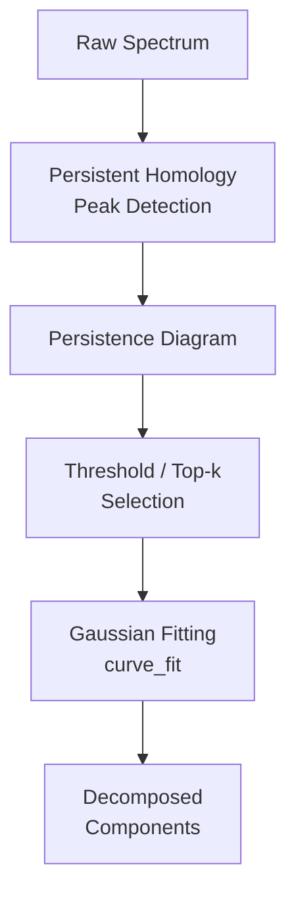

# Plan of Attack

A step-by-step roadmap from prototype to benchmarked tool.

## Phase 1: Core algorithm

**Goal**: Implement 0-dim persistent homology peak detection and Gaussian fitting.

- [x] Implement the union-find based persistence algorithm for 1D signals
- [x] Output ranked list of `(index, birth, death, persistence)` tuples
- [x] Fit sum-of-Gaussians using persistence-detected peaks as initial guesses
- [x] Basic test suite with synthetic spectra

**Status**: Complete — see `packages/phspectra/`.

## Phase 2: Synthetic benchmarks

**Goal**: Compare against GaussPy on controlled synthetic spectra.

- [ ] Generate synthetic spectra with known ground-truth components (varying SNR, line widths, blending)
- [ ] Implement evaluation metrics: number of components recovered, parameter accuracy (amplitude, mean, width), BIC/AIC
- [ ] Run GaussPy with optimally-trained alpha on the same dataset
- [ ] Compare: accuracy vs. number of components, performance vs. SNR
- [ ] Produce comparison plots and tables for documentation

## Phase 3: Real data application

**Goal**: Apply to real HI 21-cm survey data.

- [ ] Obtain sample spectra from GALFA-HI or similar survey
- [ ] Run phspectra decomposition on a representative sample
- [ ] Compare with published GaussPy+ decompositions where available
- [ ] Analyse persistence diagrams for systematic patterns

## Phase 4: Scalability and deployment

**Goal**: Make it practical for large surveys.

- [ ] Profile and optimise the core algorithm for large spectral cubes
- [ ] Add spatial coherence constraints (neighbouring spectra should have similar decompositions)
- [ ] Package for pip installation with minimal dependencies
- [ ] Deploy processing infrastructure on AWS (see `packages/infrastructure/`)

## Architecture overview

## Key design decisions

1. **No heavy TDA libraries**: The 0-dim persistence algorithm for 1D signals is simple enough (~50 lines) to implement from scratch. This avoids pulling in large dependencies like `ripser` or `gudhi`.

2. **scipy for fitting**: `scipy.optimize.curve_fit` is well-tested and sufficient for our needs. We don't need a full Bayesian framework at this stage.

3. **$\beta$ as the sole free parameter**: The persistence threshold is set as $\beta \times \sigma_{\mathrm{rms}}$, where $\sigma_{\mathrm{rms}}$ is estimated robustly from the data. Training $\beta$ is a simple 1-D optimization, compared to GaussPy's multi-parameter search over synthetic spectra.
