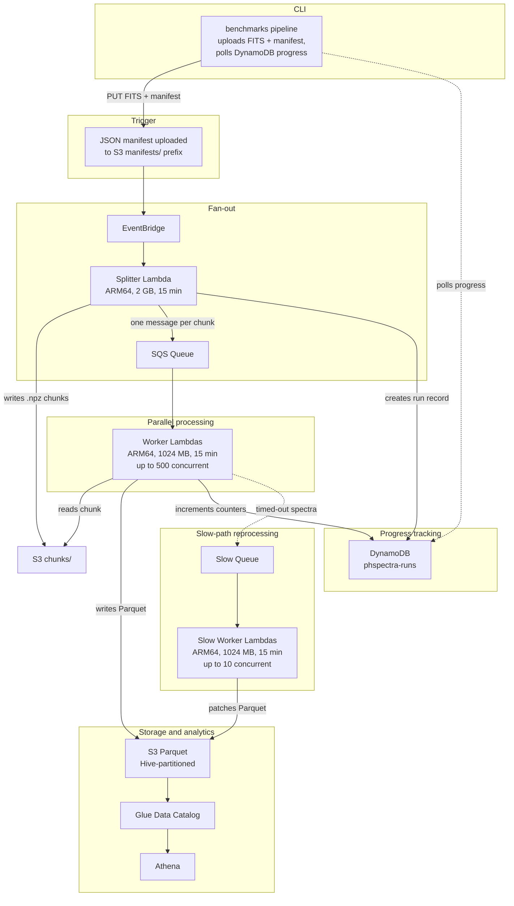
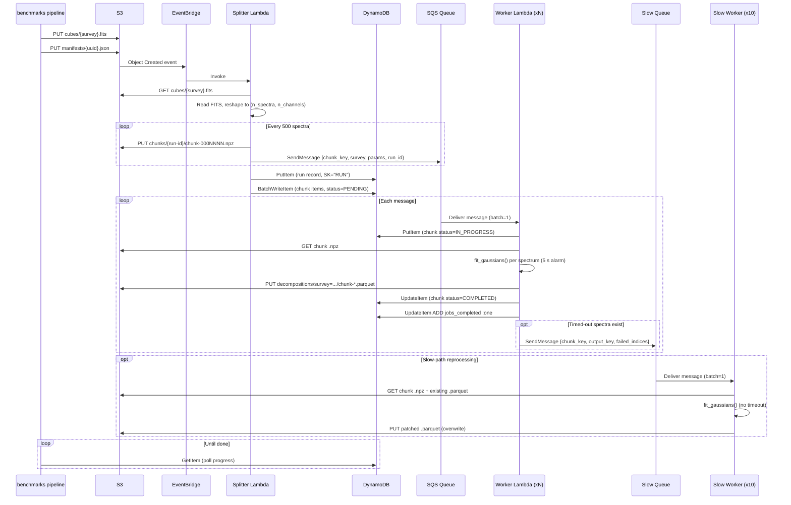
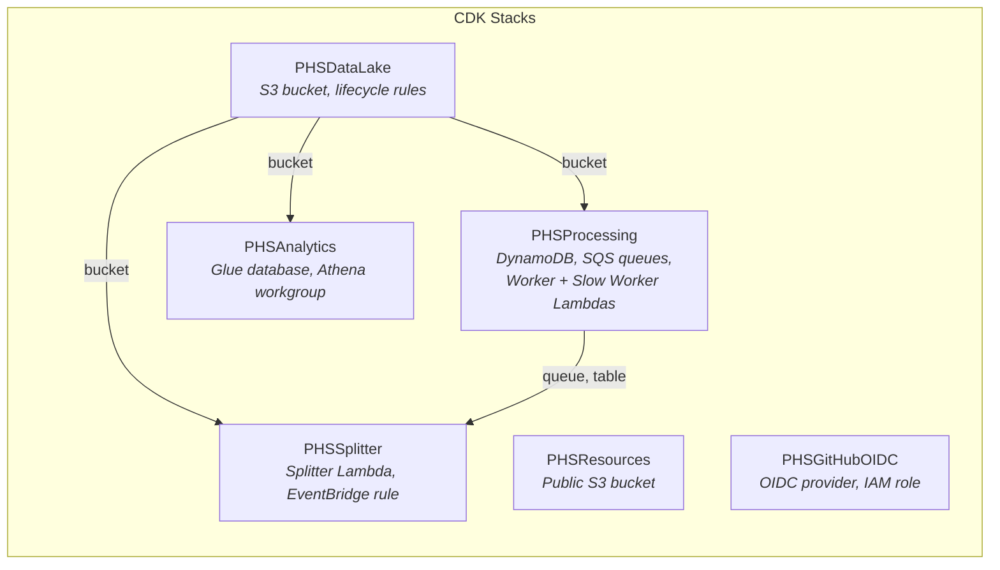

# AWS Processing Pipeline

Running phspectra on full survey cubes (2.3M+ spectra per cube) is impractical on a single machine. This page documents the event-driven, serverless pipeline on AWS that parallelises the work across hundreds of Lambda workers.

## Architecture

The pipeline is event-driven. Uploading a JSON manifest to S3 triggers the entire flow automatically -- no orchestrator, no manual steps. The `benchmarks pipeline` CLI is the primary interface: it uploads the FITS cube and manifest, then polls DynamoDB until all workers finish.



### What each component does

| Component              | Role                                                                                                                                                                                                                                                                                                                                                                                                                                                                                                                                             |
| ---------------------- | ------------------------------------------------------------------------------------------------------------------------------------------------------------------------------------------------------------------------------------------------------------------------------------------------------------------------------------------------------------------------------------------------------------------------------------------------------------------------------------------------------------------------------------------------ |
| **EventBridge**        | Watches the S3 bucket for new objects. A `.json` file in `manifests/` triggers the splitter.                                                                                                                                                                                                                                                                                                                                                                                                                                                     |
| **Splitter Lambda**    | Reads the FITS cube with `astropy`, reshapes the data into a flat array of spectra, groups them into chunks of 500, writes each chunk as a compressed `.npz` file, sends one SQS message per chunk, and creates a run record in DynamoDB.                                                                                                                                                                                                                                                                                                        |
| **SQS Queue**          | Decouples the splitter from the workers. Messages are retained for 14 days. Failed messages are retried up to 3 times before landing in a dead-letter queue for inspection.                                                                                                                                                                                                                                                                                                                                                                      |
| **Worker Lambda**      | Reads a single `.npz` chunk from S3, marks its chunk item as `IN_PROGRESS`, runs `fit_gaussians(spectrum, **params)` on each spectrum with a per-spectrum alarm timeout (default 5 s), builds a PyArrow table, writes the result as a Snappy-compressed Parquet file, marks the chunk `COMPLETED` (or `FAILED`), and increments the DynamoDB run counter. Spectra that time out are marked with `n_components = -1` and forwarded to the slow queue for reprocessing. If the Lambda deadline is within 60 s, all remaining spectra are deferred. |
| **Slow Queue**         | Receives messages from the worker for chunks that contain timed-out spectra. 16-minute visibility timeout, 14-day retention, 1 retry before dead-letter queue.                                                                                                                                                                                                                                                                                                                                                                                   |
| **Slow Worker Lambda** | Re-processes only the timed-out spectra from a chunk -- without the per-spectrum alarm -- downloads the original `.npz` and the existing Parquet file, patches the failed rows in place, and overwrites the Parquet on S3. Capped at 10 concurrent invocations to avoid runaway costs on pathological spectra.                                                                                                                                                                                                                                   |
| **DynamoDB**           | Tracks run and chunk progress. The splitter creates a run record with `jobs_total` and batch-writes one chunk item per chunk (`PENDING`). Workers update chunk status and atomically increment `jobs_completed` or `jobs_failed` on the run record. The CLI polls this table to display a progress bar.                                                                                                                                                                                                                                          |
| **S3 (Parquet)**       | Results are written under `decompositions/survey={name}/`. The `beta` value is stored as a regular column inside the Parquet files.                                                                                                                                                                                                                                                                                                                                                                                                              |
| **Glue + Athena**      | The Glue table uses partition projection (survey only) -- no crawlers, no `MSCK REPAIR TABLE`. Athena can query results across all surveys immediately after the workers finish writing.                                                                                                                                                                                                                                                                                                                                                         |

## S3 bucket layout

A single bucket holds all data:

```
phspectra-{env}-data/
|-- cubes/{survey}.fits                # FITS cubes (deterministic key, idempotent re-upload)
|-- manifests/                         # JSON manifests (trigger)
|-- chunks/{run-id}/chunk-*.npz        # Temporary spectrum chunks (7-day TTL)
|-- decompositions/                    # Results (Parquet, partitioned by survey)
|   +-- survey={name}/chunk-*.parquet
+-- athena-results/                    # Athena query output (7-day TTL)
```

The `chunks/` and `athena-results/` prefixes have a 7-day lifecycle rule -- intermediate data is cleaned up automatically.

## How to use it

### Using the CLI (recommended)

The `benchmarks pipeline` command handles the full workflow: uploads the FITS cube, creates a manifest, and polls DynamoDB with a progress bar until all workers finish.

```bash
# Decompose with library-default parameters
uv run benchmarks pipeline my-survey.fits

# Decompose with a specific beta
uv run benchmarks pipeline my-survey.fits --param beta=3.5

# Pass multiple fit_gaussians parameters
uv run benchmarks pipeline my-survey.fits --param beta=3.5 --param snr_min=2.0

# Re-process an already-uploaded cube
uv run benchmarks pipeline --manifest --cube-key cubes/grs.fits --survey grs --param beta=4.0
```

### Uploading a manifest directly

To trigger the pipeline without the CLI, upload a JSON manifest to `manifests/`:

```json
{
  "cube_key": "cubes/grs.fits",
  "survey": "grs",
  "params": { "beta": 3.5, "snr_min": 2.0 }
}
```

```bash
aws s3 cp manifest.json s3://phspectra-development-data/manifests/manifest.json
```

The splitter fans out one SQS message per chunk. For the GRS test field with 4,200 spectra this produces $\lceil 4200/500 \rceil = 9$ worker invocations, all running in parallel.

## DynamoDB run tracking

The `phspectra-runs` table uses a composite key (`PK` + `SK`) to store both **run-level** and **chunk-level** items under the same partition. The splitter creates the run item and batch-writes one `PENDING` chunk item per chunk. Workers update their chunk to `IN_PROGRESS` on start and `COMPLETED`/`FAILED` on finish.

| Attribute        | Type   | Description                                                   |
| ---------------- | ------ | ------------------------------------------------------------- |
| `PK`             | String | Run ID (partition key, UUID)                                  |
| `SK`             | String | `"RUN"` for run items, `"CHUNK#chunk-{start:07d}"` for chunks |
| `survey`         | String | Survey name                                                   |
| `created_at`     | String | ISO 8601 timestamp                                            |
| `jobs_total`     | Number | Total chunks to process                                       |
| `jobs_completed` | Number | Atomically incremented by each successful worker              |
| `jobs_failed`    | Number | Atomically incremented on worker failure                      |
| `params`         | String | JSON-encoded fit_gaussians params (omitted if empty)          |
| `n_spectra`      | Number | Total spectra in the cube                                     |
| `n_chunks`       | Number | Number of chunks created                                      |

A GSI (`GSI1`) indexes run items by survey and creation time, enabling efficient lookups without full-table scans.

The CLI polls this table every 5 seconds (configurable with `--poll-interval`) and displays a rich progress bar. A run is complete when `jobs_completed + jobs_failed >= jobs_total`. If progress stalls for `--stall-timeout` seconds (default 1800s), the CLI prints a warning and exits -- this guards against Lambda timeouts that kill workers before they can increment the failure counter.

For the full chunk-level schema, access patterns, and operational queries, see [Pipeline Visibility](./visibility.md).

## Querying results with Athena

The Glue table `decompositions` is pre-configured with [partition projection](https://docs.aws.amazon.com/athena/latest/ug/partition-projection.html) on the `survey` partition, so new partitions are discovered instantly without running crawlers.

### Parquet schema

| Column                 | Type            | Description                                                       |
| ---------------------- | --------------- | ----------------------------------------------------------------- |
| `x`                    | `int32`         | Spatial x pixel coordinate                                        |
| `y`                    | `int32`         | Spatial y pixel coordinate                                        |
| `beta`                 | `float64`       | Persistence threshold ($\beta$) used for this spectrum            |
| `rms`                  | `float64`       | MAD-based noise estimate ($\sigma_{\mathrm{rms}}$)                |
| `min_persistence`      | `float64`       | Persistence threshold used ($\beta \times \sigma_{\mathrm{rms}}$) |
| `n_components`         | `int32`         | Number of fitted Gaussian components                              |
| `component_amplitudes` | `list<float64>` | Amplitude of each component                                       |
| `component_means`      | `list<float64>` | Mean position (channel units)                                     |
| `component_stddevs`    | `list<float64>` | Standard deviation of each component                              |

Partition key (encoded in the S3 path, not in the Parquet files): `survey` (string).

### Built-in named queries

Two named queries are deployed with the stack and accessible from the Athena console under the `phspectra` workgroup.

**Beta component-count comparison** -- Compare how the number of fitted components varies with $\beta$ across a survey:

```sql
SELECT
  beta,
  COUNT(*) AS n_spectra,
  AVG(n_components) AS avg_components,
  APPROX_PERCENTILE(n_components, 0.5) AS median_components,
  STDDEV(CAST(n_components AS DOUBLE)) AS std_components
FROM phspectra.decompositions
WHERE survey = 'grs'
GROUP BY beta
ORDER BY beta;
```

This is the primary query for choosing the optimal $\beta$: look for the value where the component count stabilises.

**RMS distribution sanity check** -- Verify noise estimation across surveys:

```sql
SELECT
  survey,
  COUNT(*) AS n_spectra,
  AVG(rms) AS avg_rms,
  APPROX_PERCENTILE(rms, 0.5) AS median_rms,
  MIN(rms) AS min_rms,
  MAX(rms) AS max_rms
FROM phspectra.decompositions
GROUP BY survey
ORDER BY survey;
```

### Custom queries

Since the data is standard Parquet on S3, you can query it with any tool that speaks Parquet -- not just Athena. For example, loading a survey into a pandas DataFrame:

```python
import pandas as pd

df = pd.read_parquet(
    "s3://phspectra-development-data/decompositions/survey=grs/"
)
```

Or using DuckDB locally:

```sql
SELECT beta, AVG(n_components)
FROM read_parquet('s3://phspectra-development-data/decompositions/survey=grs/chunk-*.parquet',
                  hive_partitioning=true)
GROUP BY beta;
```

## Processing flow in detail

The following sequence shows what happens when you run `benchmarks pipeline`:



## Infrastructure as code

The pipeline is defined across six CDK stacks:



| Stack        | Source file                | Resources                                                                                                     |
| ------------ | -------------------------- | ------------------------------------------------------------------------------------------------------------- |
| `DataLake`   | `lib/data-lake.stack.ts`   | S3 bucket with EventBridge notifications, lifecycle rules                                                     |
| `Processing` | `lib/processing.stack.ts`  | DynamoDB runs table, SQS queues (chunks + DLQ, slow + slow DLQ), Worker + Slow Worker Lambdas (Docker, ARM64) |
| `Splitter`   | `lib/splitter.stack.ts`    | Splitter Lambda (Docker, ARM64), EventBridge rule for manifests                                               |
| `Analytics`  | `lib/analytics.stack.ts`   | Glue database + table, Athena workgroup, named queries                                                        |
| `Resources`  | `lib/resources.stack.ts`   | Public S3 bucket for static assets                                                                            |
| `GitHubOIDC` | `lib/github-oidc.stack.ts` | GitHub Actions OIDC provider, IAM role for passwordless CI/CD                                                 |

### Worker Docker build

The Worker Lambda uses a Docker container image. During `cdk synth`, the phspectra source is copied into the Docker context and built from source inside the container. This ensures the C extension (`_gaussfit.c`) is compiled for the target platform (`linux/arm64`), regardless of what OS runs the CDK synthesis.

### Deploying

Prerequisites: AWS credentials configured, Docker running (for Lambda container images), Node.js 22+.

```bash
# Synthesise CloudFormation (no deploy)
yarn workspace @phspectra/infrastructure cdk synth

# Deploy all stacks
yarn workspace @phspectra/infrastructure cdk deploy --all

# Preview changes
yarn workspace @phspectra/infrastructure cdk diff
```

### Environment handling

Resource names include the environment: `phspectra-development` or `phspectra-production`. Key differences:

| Setting                  | Development                                | Production           |
| ------------------------ | ------------------------------------------ | -------------------- |
| S3 bucket removal policy | `DESTROY` (auto-deleted on stack teardown) | `RETAIN` (preserved) |
| Auto-delete objects      | Yes                                        | No                   |
| Athena scan limit        | 10 GB                                      | 10 GB                |

## Design decisions

**Why Lambda, not Batch or EMR?** A chunk of 500 spectra fits well within a 15-minute Lambda timeout and 1024 MB memory (~320 s observed average per chunk, including S3 I/O and DynamoDB writes). Lambda's per-invocation billing and instant scaling make it far cheaper and simpler than maintaining a Spark cluster for this workload.

**Why Docker container images?** The scientific Python stack (numpy, scipy, astropy, pyarrow) includes C extensions that exceed Lambda's 250 MB zip layer limit. Container images support up to 10 GB. Additionally, PHSpectra itself has a C extension that must be compiled for the target architecture.

**Why ARM64?** Graviton2 Lambda is 20% cheaper per GB-second than x86. All dependencies (numpy, scipy, pyarrow, astropy) publish `aarch64` wheels.

**Why `.npz` chunks on S3 instead of SQS payloads?** A chunk of 500 spectra with 500 channels is ~2 MB compressed. SQS messages are limited to 256 KB.

**Why partition projection instead of Glue crawlers?** Partition projection discovers new partitions instantly by pattern-matching the S3 path (survey only). Crawlers add latency and cost, and must be triggered after each write.

**Why PyArrow instead of pandas?** PyArrow writes Parquet natively with proper support for nested types (`list<float64>` columns). It has a smaller footprint than pandas and avoids unnecessary DataFrame overhead in a write-only Lambda.

**Why build from source in Docker?** PHSpectra includes a C extension (`_gaussfit.c`) for the Levenberg-Marquardt solver and persistence peak detection. Pre-building a wheel on the developer's machine produces a platform-specific artifact (e.g. macOS x86_64) that cannot be installed in the Lambda container (Linux ARM64). Building from source inside Docker ensures the extension is compiled for the correct target.

**Why a separate slow worker?** Most spectra decompose in well under 5 seconds, but rare pathological cases (e.g. high-SNR spectra with many overlapping components) can take minutes. The main worker sets a per-spectrum `SIGALRM` timeout (default 5 s) and bails out 60 s before the Lambda deadline, marking timed-out spectra with `n_components = -1`. These are forwarded to a dedicated slow queue processed by a separate Lambda (max 10 concurrent) that re-runs `fit_gaussians` without the alarm, patches the Parquet file in place, and overwrites it on S3. This keeps the fast path fast (500 concurrent, predictable latency) while ensuring no spectra are permanently lost.

## Cost estimates

| Scenario                        | Lambda invocations                           | Estimated cost |
| ------------------------------- | -------------------------------------------- | -------------- |
| Single GRS tile (~116k spectra) | ~233 workers + slow workers + 1 splitter     | ~$2            |
| Full GRS survey (2.3M spectra)  | ~5,100 workers + slow workers + 22 splitters | ~$40           |

Pricing assumes ARM64 (Graviton2) at \$0.0000133334/GB-s, 500 spectra per chunk. Worker and Slow Worker: 1024 MB, Splitter: 2048 MB. Observed average worker duration is ~320 s per chunk (~640 ms per spectrum including S3 I/O, DynamoDB writes, and cold starts). The slow worker handles spectra that exceed the 5 s per-spectrum alarm and adds ~30% to the worker cost. The dominant cost is Lambda compute. S3 storage for Parquet results is negligible (a few cents per GB-month). Athena charges \$5/TB scanned -- a typical query over one survey scans well under 1 GB.
