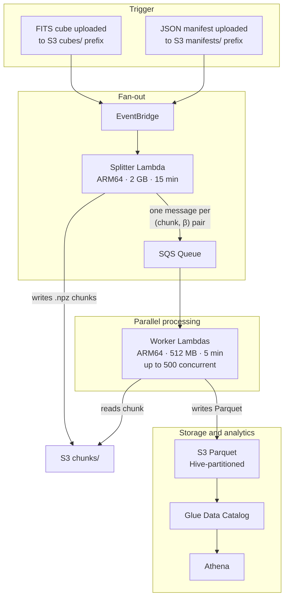
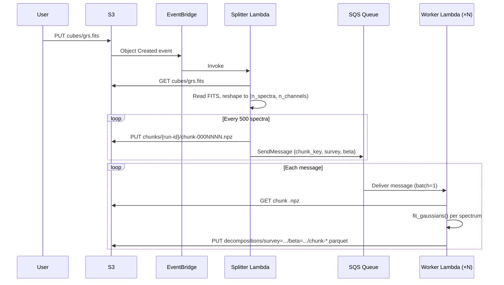
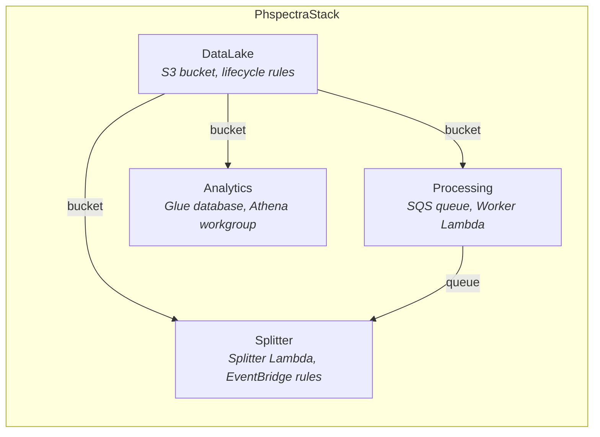

# AWS Processing Pipeline

Running phspectra on full survey cubes (2.3M+ spectra per cube, multiple $\beta$ values) is impractical on a single machine. This page documents the event-driven, serverless pipeline on AWS that parallelises the work across hundreds of Lambda workers.

## Architecture

The pipeline is fully event-driven. Uploading a FITS cube or a JSON manifest to S3 triggers the entire flow automatically — no orchestrator, no polling, no manual steps.



### What each component does

| Component           | Role                                                                                                                                                                                                                    |
| ------------------- | ----------------------------------------------------------------------------------------------------------------------------------------------------------------------------------------------------------------------- |
| **EventBridge**     | Watches the S3 bucket for new objects. A `.fits` file in `cubes/` triggers decomposition with the default $\beta = 5.0$. A `.json` file in `manifests/` triggers a full beta sweep.                                     |
| **Splitter Lambda** | Reads the FITS cube with `astropy`, reshapes the data into a flat array of spectra, groups them into chunks of 500, writes each chunk as a compressed `.npz` file, and sends one SQS message per (chunk, $\beta$) pair. |
| **SQS Queue**       | Decouples the splitter from the workers. Messages are retained for 14 days. Failed messages are retried up to 3 times before landing in a dead-letter queue for inspection.                                             |
| **Worker Lambda**   | Reads a single `.npz` chunk from S3, runs `fit_gaussians(spectrum, beta=β)` on each spectrum, builds a PyArrow table, and writes the result as a Snappy-compressed Parquet file to the output prefix.                   |
| **S3 (Parquet)**    | Results are written in Hive-style partitioning: `decompositions/survey={name}/beta={value}/`. This layout enables Athena to read only the partitions relevant to a query.                                               |
| **Glue + Athena**   | The Glue table uses partition projection — no crawlers, no `MSCK REPAIR TABLE`. Athena can query results across all surveys and $\beta$ values immediately after the workers finish writing.                            |

## S3 bucket layout

A single bucket holds all data:

```
phspectra-{env}-data/
├── cubes/                          # Input FITS files
├── manifests/                      # Beta sweep JSON manifests
├── chunks/{run-id}/chunk-*.npz     # Temporary spectrum chunks (7-day TTL)
├── decompositions/                 # Results (Parquet, Hive-partitioned)
│   └── survey={name}/beta={value}/chunk-*.parquet
└── athena-results/                 # Athena query output (7-day TTL)
```

The `chunks/` and `athena-results/` prefixes have a 7-day lifecycle rule — intermediate data is cleaned up automatically.

## How to use it

### Decompose a single cube

Upload a FITS cube to the `cubes/` prefix. The pipeline runs automatically with the default persistence threshold ($\beta = 5.0$).

```bash
aws s3 cp my-survey.fits s3://phspectra-development-data/cubes/my-survey.fits
```

The survey name used for partitioning is derived from the filename (e.g. `my-survey.fits` becomes `my-survey`).

### Run a beta sweep

To test multiple $\beta$ values on the same cube, upload a JSON manifest to `manifests/`:

```json
{
  "cube_key": "cubes/grs-test-field.fits",
  "survey": "grs",
  "beta_values": [3, 4, 5, 6, 7, 8]
}
```

```bash
aws s3 cp beta-sweep.json s3://phspectra-development-data/manifests/beta-sweep.json
```

The splitter fans out SQS messages for every (chunk, $\beta$) combination. For a cube with 1,200 spectra and 6 $\beta$ values, this produces $\lceil 1200/500 \rceil \times 6 = 18$ worker invocations, all running in parallel.

### Makefile shortcuts

```bash
make upload-test-cube     # Upload the GRS test field FITS
make upload-beta-sweep    # Trigger a sweep with β = [3, 4, 5, 6, 7, 8]
make synth                # Synthesise CloudFormation (no deploy)
make deploy               # Deploy the stack (ENVIRONMENT=development)
make diff                 # Preview changes against the deployed stack
```

## Querying results with Athena

The Glue table `decompositions` is pre-configured with [partition projection](https://docs.aws.amazon.com/athena/latest/ug/partition-projection.html), so new partitions are discovered instantly without running crawlers.

### Parquet schema

| Column                 | Type            | Description                                                       |
| ---------------------- | --------------- | ----------------------------------------------------------------- |
| `x`                    | `int32`         | Spatial x pixel coordinate                                        |
| `y`                    | `int32`         | Spatial y pixel coordinate                                        |
| `rms`                  | `float64`       | MAD-based noise estimate ($\sigma_{\mathrm{rms}}$)                |
| `min_persistence`      | `float64`       | Persistence threshold used ($\beta \times \sigma_{\mathrm{rms}}$) |
| `n_components`         | `int32`         | Number of fitted Gaussian components                              |
| `component_amplitudes` | `list<float64>` | Amplitude of each component                                       |
| `component_means`      | `list<float64>` | Mean position (channel units)                                     |
| `component_stddevs`    | `list<float64>` | Standard deviation of each component                              |

Partition keys (encoded in the S3 path, not in the Parquet files): `survey` (string), `beta` (string).

### Built-in named queries

Two named queries are deployed with the stack and accessible from the Athena console under the `phspectra-{env}` workgroup.

**Beta component-count comparison** — Compare how the number of fitted components varies with $\beta$ across a survey:

```sql
SELECT
  beta,
  COUNT(*) AS n_spectra,
  AVG(n_components) AS avg_components,
  APPROX_PERCENTILE(n_components, 0.5) AS median_components,
  STDDEV(CAST(n_components AS DOUBLE)) AS std_components
FROM phspectra_development.decompositions
WHERE survey = 'grs'
GROUP BY beta
ORDER BY beta;
```

This is the primary query for choosing the optimal $\beta$: look for the value where the component count stabilises.

**RMS distribution sanity check** — Verify noise estimation across surveys:

```sql
SELECT
  survey,
  COUNT(*) AS n_spectra,
  AVG(rms) AS avg_rms,
  APPROX_PERCENTILE(rms, 0.5) AS median_rms,
  MIN(rms) AS min_rms,
  MAX(rms) AS max_rms
FROM phspectra_development.decompositions
GROUP BY survey
ORDER BY survey;
```

### Custom queries

Since the data is standard Parquet on S3, you can query it with any tool that speaks Parquet — not just Athena. For example, loading a single partition into a pandas DataFrame:

```python
import pandas as pd

df = pd.read_parquet(
    "s3://phspectra-development-data/decompositions/survey=grs/beta=5.0/"
)
```

Or using DuckDB locally:

```sql
SELECT AVG(n_components)
FROM read_parquet('s3://phspectra-development-data/decompositions/survey=grs/beta=*/chunk-*.parquet',
                  hive_partitioning=true)
WHERE beta = '5.0';
```

## Processing flow in detail

The following sequence shows what happens when a FITS cube is uploaded:



## Infrastructure as code

The pipeline is defined in a single CDK stack (`PhspectraStack`) composed of four constructs:



| Construct    | Source file                | Resources                                                 |
| ------------ | -------------------------- | --------------------------------------------------------- |
| `DataLake`   | `constructs/data-lake.ts`  | S3 bucket with EventBridge notifications, lifecycle rules |
| `Processing` | `constructs/processing.ts` | SQS queue + DLQ, Worker Lambda (Docker, ARM64)            |
| `Splitter`   | `constructs/splitter.ts`   | Splitter Lambda (Docker, ARM64), 2 EventBridge rules      |
| `Analytics`  | `constructs/analytics.ts`  | Glue database + table, Athena workgroup, named queries    |

### Deploying

Prerequisites: AWS credentials configured, Docker running (for Lambda container images), Node.js 20+.

```bash
make install          # Install JS + Python dependencies
make deploy           # Deploy to development (default)

# Or target a specific environment:
ENVIRONMENT=production make deploy
```

The `deploy` target automatically builds the phspectra wheel and copies it into the worker Lambda's Docker context before synthesising the template.

### Environment handling

The stack name and all resource names include the environment: `phspectra-development`, `phspectra-staging`, or `phspectra-production`. Key differences between environments:

| Setting                  | Development                                | Production           |
| ------------------------ | ------------------------------------------ | -------------------- |
| S3 bucket removal policy | `DESTROY` (auto-deleted on stack teardown) | `RETAIN` (preserved) |
| Auto-delete objects      | Yes                                        | No                   |
| Athena scan limit        | 10 GB                                      | 10 GB                |

## Design decisions

**Why Lambda, not Batch or EMR?** Each spectrum takes ~50ms to decompose. A chunk of 500 spectra fits well within a 5-minute Lambda timeout and 512 MB memory. Lambda's per-invocation billing and instant scaling make it far cheaper and simpler than maintaining a Spark cluster for this workload.

**Why Docker container images?** The scientific Python stack (numpy, scipy, astropy, pyarrow) includes C extensions that exceed Lambda's 250 MB zip layer limit. Container images support up to 10 GB.

**Why ARM64?** Graviton2 Lambda is 20% cheaper per GB-second than x86. All dependencies (numpy, scipy, pyarrow, astropy) publish `aarch64` wheels.

**Why `.npz` chunks on S3 instead of SQS payloads?** A chunk of 500 spectra with 500 channels is ~2 MB compressed. SQS messages are limited to 256 KB.

**Why partition projection instead of Glue crawlers?** Partition projection discovers new partitions instantly by pattern-matching the S3 path. Crawlers add latency and cost, and must be triggered after each write.

**Why PyArrow instead of pandas?** PyArrow writes Parquet natively with proper support for nested types (`list<float64>` columns). It has a smaller footprint than pandas and avoids unnecessary DataFrame overhead in a write-only Lambda.

## Cost estimates

| Scenario                                          | Lambda invocations | Estimated cost |
| ------------------------------------------------- | ------------------ | -------------- |
| GRS test field, 6 $\beta$ values (7,200 spectra)  | 18                 | < $0.01        |
| Full GRS survey, 6 $\beta$ values (13.8M spectra) | ~27,600            | ~$13           |

The dominant cost is Lambda compute. S3 storage for Parquet results is negligible (a few cents per GB-month). Athena charges \$5/TB scanned — a typical query over one survey and one $\beta$ value scans well under 1 GB.
