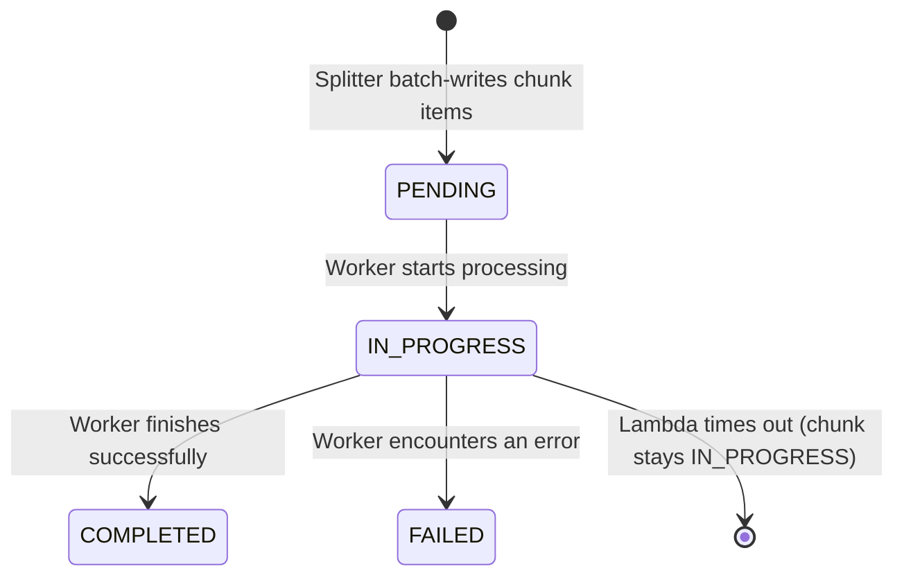

# Pipeline Visibility

When a pipeline run spans thousands of Lambda invocations, knowing _which_ chunks succeeded, failed, or got stuck is critical. This page documents the DynamoDB schema that gives per-chunk visibility into every run.

## Problem

The original schema tracked only aggregate counters (`jobs_completed`, `jobs_failed`) on a single run item. When a Lambda timed out, the chunk was never counted -- neither completed nor failed -- leaving the run permanently stuck. The first full GRS run (22 tiles) produced 221 DLQ messages that were invisible from DynamoDB.

## DynamoDB Schema

The `phspectra-runs` table uses a composite key (`PK` + `SK`) to store both run-level and chunk-level items under the same partition.

### Key schema

| Attribute | Type   | Purpose                                                                |
| --------- | ------ | ---------------------------------------------------------------------- |
| `PK`      | String | `run_id` (UUID) -- shared between the run item and all its chunk items |
| `SK`      | String | `"RUN"` for run items, `"CHUNK#chunk-{start:07d}"` for chunk items     |

### GSI1 -- query runs by survey

| Attribute | Type   | Purpose                    |
| --------- | ------ | -------------------------- |
| `GSI1_PK` | String | `survey` (e.g. `"grs-15"`) |
| `GSI1_SK` | String | `created_at` ISO timestamp |

Projection: `ALL`. Set on run items only.

### Run item

Created by the splitter Lambda when it fans out chunks.

| Attribute        | Type   | Description                                        |
| ---------------- | ------ | -------------------------------------------------- |
| `PK`             | String | Run ID (UUID)                                      |
| `SK`             | String | Always `"RUN"`                                     |
| `GSI1_PK`        | String | Survey name (for GSI1 queries)                     |
| `GSI1_SK`        | String | `created_at` (for GSI1 range queries)              |
| `survey`         | String | Survey name                                        |
| `created_at`     | String | ISO 8601 timestamp                                 |
| `jobs_total`     | Number | Total chunks to process                            |
| `jobs_completed` | Number | Atomically incremented by each successful worker   |
| `jobs_failed`    | Number | Atomically incremented on worker failure           |
| `n_spectra`      | Number | Total spectra in the cube                          |
| `n_chunks`       | Number | Number of chunks created                           |
| `params`         | String | JSON-encoded `fit_gaussians` params (if non-empty) |

### Chunk item

Created by the splitter as `PENDING`, updated by workers as they start and finish.

| Attribute      | Type   | Description                                        |
| -------------- | ------ | -------------------------------------------------- |
| `PK`           | String | Run ID (same as the parent run)                    |
| `SK`           | String | `"CHUNK#chunk-{start:07d}"`                        |
| `status`       | String | `PENDING` / `IN_PROGRESS` / `COMPLETED` / `FAILED` |
| `chunk_key`    | String | S3 key of the `.npz` file                          |
| `n_spectra`    | Number | Spectra count in this chunk                        |
| `created_at`   | String | ISO timestamp (set by splitter)                    |
| `started_at`   | String | ISO timestamp (set by worker on start)             |
| `completed_at` | String | ISO timestamp (set by worker on finish)            |
| `duration_ms`  | Number | Wall-clock processing time                         |
| `output_key`   | String | Parquet S3 key (on success)                        |
| `error`        | String | Error message, truncated to 1 KB (on failure)      |

### Chunk lifecycle



When a Lambda times out, the chunk remains `IN_PROGRESS` with a `started_at` timestamp but no `completed_at`. This is exactly the gap the old schema could not detect.

## Access Patterns

### 1. Get a run

Fetch the run-level summary for a known run ID.

```
GetItem(PK=run_id, SK="RUN")
```

### 2. List all chunks for a run

See the status of every chunk in a run.

```
Query(PK=run_id, SK begins_with "CHUNK#")
```

### 3. Find runs by survey

Discover the most recent run for a given survey (used by the CLI after uploading a manifest).

```
Query(
  IndexName="GSI1",
  GSI1_PK=survey,
  GSI1_SK >= not_before,
  ScanIndexForward=False,
  Limit=1
)
```

This replaced a full-table `Scan` with a filter expression.

### 4. Detect stuck chunks

Find chunks where the worker started but never finished (Lambda timeout, OOM, etc.).

```
Query(PK=run_id, SK begins_with "CHUNK#")
  -> filter: status = "IN_PROGRESS" AND started_at < (now - 15 min)
```

If a chunk has been `IN_PROGRESS` for longer than the Lambda timeout (15 minutes), the worker is dead and the chunk will land in the DLQ after SQS retries.

### 5. Count failures with details

```
Query(PK=run_id, SK begins_with "CHUNK#")
  -> filter: status = "FAILED"
```

Each failed chunk carries the truncated error message and timing, so you can see _why_ it failed and how long it ran before failing.

## CLI example queries

These use the AWS CLI to inspect run state directly.

```bash
# Get the run summary
aws dynamodb get-item \
  --table-name phspectra-runs \
  --key '{"PK":{"S":"<run-id>"},"SK":{"S":"RUN"}}'

# List all chunks for a run
aws dynamodb query \
  --table-name phspectra-runs \
  --key-condition-expression 'PK = :pk AND begins_with(SK, :prefix)' \
  --expression-attribute-values '{":pk":{"S":"<run-id>"},":prefix":{"S":"CHUNK#"}}'

# Find stuck chunks (IN_PROGRESS for over 15 min)
aws dynamodb query \
  --table-name phspectra-runs \
  --key-condition-expression 'PK = :pk AND begins_with(SK, :prefix)' \
  --filter-expression '#s = :status' \
  --expression-attribute-names '{"#s":"status"}' \
  --expression-attribute-values '{":pk":{"S":"<run-id>"},":prefix":{"S":"CHUNK#"},":status":{"S":"IN_PROGRESS"}}'

# Find most recent run for a survey
aws dynamodb query \
  --table-name phspectra-runs \
  --index-name GSI1 \
  --key-condition-expression 'GSI1_PK = :survey' \
  --expression-attribute-values '{":survey":{"S":"grs-15"}}' \
  --scan-index-forward false \
  --limit 1
```
