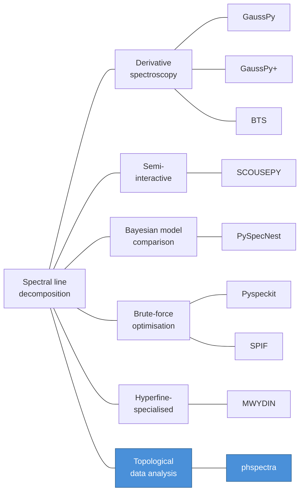

# PHSpectra

**Persistent homology for spectral line decomposition.**

## The problem

Along any line of sight, radio-astronomical spectra -- HI 21-cm, ${}^{13}$CO, and other molecular tracers -- sample emission from multiple gas clouds at different radial velocities. In the optically thin limit each cloud contributes a Gaussian profile, and the observed spectrum is a linear superposition of these components. Recovering the individual amplitudes, centroid velocities, and widths is a **blind decomposition** problem: given a noisy 1-D signal, determine the number of components and fit their parameters without prior knowledge. For modern surveys that contain millions of spectra ([GALFA-HI](https://purcell.ssl.berkeley.edu/), [THOR](https://www2.mpia-hd.mpg.de/thor/Overview.html), [GASKAP](https://research.csiro.au/gaskap-hi/), [GRS](idea-and-plan/data-sources#grs---galactic-ring-survey)), the decomposition method must be both accurate and scalable.

## Existing approaches

Several families of algorithms have been developed for this task:

| Approach                      | Examples                                                                                                                                                                                                                                                                                                                                      | Key idea                                                                 | Limitation                                                                                                                           |
| ----------------------------- | --------------------------------------------------------------------------------------------------------------------------------------------------------------------------------------------------------------------------------------------------------------------------------------------------------------------------------------------- | ------------------------------------------------------------------------ | ------------------------------------------------------------------------------------------------------------------------------------ |
| **Derivative spectroscopy**   | [GaussPy](https://arxiv.org/abs/1409.2840) ([Lindner et al. 2015](https://doi.org/10.3847/0004-6256/149/4/138)), [GaussPy+](https://arxiv.org/abs/1906.10506) ([Riener et al. 2019](https://doi.org/10.1051/0004-6361/201833904)), [BTS](https://doi.org/10.1093/mnras/sty1604) ([Clarke et al. 2018](https://doi.org/10.1093/mnras/sty1604)) | Smoothed derivatives locate zero-crossings that mark peak positions      | Smoothing parameters ($\alpha_1$, $\alpha_2$) must be trained on synthetic spectra; smoothing can suppress closely-spaced components |
| **Semi-interactive**          | [SCOUSEPY](https://doi.org/10.3847/1538-4357/ab3c48) ([Henshaw et al. 2016](https://doi.org/10.1093/mnras/stw301), [2019](https://doi.org/10.3847/1538-4357/ab3c48))                                                                                                                                                                          | Human selects spectral averaging areas; automated fitting within regions | Requires user guidance; difficult to scale to millions of spectra                                                                    |
| **Bayesian model comparison** | [PySpecNest](https://doi.org/10.1051/0004-6361/201936536) ([Sokolov et al. 2020](https://doi.org/10.1051/0004-6361/201936536))                                                                                                                                                                                                                | Full posterior sampling with evidence-ratio model selection              | Rigorous but computationally expensive per spectrum                                                                                  |
| **Brute-force optimisation**  | [Pyspeckit](https://doi.org/10.3847/1538-3881/ac695a) ([Ginsburg & Mirocha 2011](https://doi.org/10.3847/1538-3881/ac695a)), [SPIF](https://doi.org/10.1051/0004-6361/202349044) ([Juvela et al. 2024](https://doi.org/10.1051/0004-6361/202349044))                                                                                          | Many random initialisations; keep best $\chi^2$                          | Robustness depends on number of restarts; GPU hardware needed for survey scale                                                       |
| **Hyperfine-specialised**     | [MWYDIN](https://doi.org/10.1093/mnras/stae1200) ([Rigby et al. 2024](https://doi.org/10.1093/mnras/stae1200))                                                                                                                                                                                                                                | Shared excitation temperature and FWHM; BIC model selection              | Limited to 3 velocity components; assumes shared physical conditions                                                                 |

Common challenges across these methods include: choosing the number of components (model selection), sensitivity to initial guesses, parameter degeneracies in optically thick or blended lines, and the trade-off between computational cost and uncertainty quantification ([Juvela et al. 2024](https://doi.org/10.1051/0004-6361/202349044)).

## A topological alternative

phspectra takes a different approach. Instead of smoothing and differentiating, or sampling a posterior, it uses **0-dimensional persistent homology** -- a tool from topological data analysis -- to identify peaks and rank them by their **topological persistence**: the height difference between a peak's birth and the level at which it merges with a taller neighbour. This persistence is a natural, scale-free measure of peak significance that requires no smoothing, no random initialisation, and no training data.

The single tuning parameter is $\beta$, which sets the minimum persistence threshold in units of the estimated noise $\sigma_\mathrm{rms}$:

$$
\pi_{\min} = \beta \times \sigma_{\mathrm{rms}}
$$

A peak is retained only if its persistence exceeds $\beta \cdot \sigma_\mathrm{rms}$, i.e. only if it is at least $\beta\sigma$ significant. The default $\beta = 3.5$ works across both real and synthetic data; sweeping from 2.0 to 4.5 changes $F_1$ by less than 0.09 (see [Beta sensitivity](results/beta)).

### How phspectra compares

|                       | Derivative methods                               | Bayesian / brute-force               | phspectra                                                        |
| --------------------- | ------------------------------------------------ | ------------------------------------ | ---------------------------------------------------------------- |
| **Peak detection**    | Smoothed derivative zero-crossings               | Random initialisation + optimisation | Persistent homology (all scales simultaneously)                  |
| **Tuning parameters** | $\alpha_1$, $\alpha_2$ (regularisation strength) | Priors, number of restarts           | $\beta$ (persistence threshold in noise units)                   |
| **Training**          | Supervised, on synthetic spectra                 | Not required, but slow per spectrum  | Not required -- default $\beta = 3.5$ generalises                |
| **Determinism**       | Deterministic                                    | Stochastic (random seeds / MCMC)     | Deterministic                                                    |
| **Scalability**       | Survey-scale on CPU                              | Survey-scale with GPU (SPIF)         | Survey-scale on serverless (AWS Lambda); ~2.3M spectra for ~\$40 |

Persistent homology provides principled initial guesses -- peak locations, amplitudes, and widths read directly from the persistence diagram -- so the subsequent least-squares fit converges reliably without random restarts. The result is a method that is **training-free**, **deterministic**, and **scalable** without GPU infrastructure.

## Quick links

- [Motivation](idea-and-plan/motivation) -- Why topology instead of derivatives?
- [Persistent Homology](idea-and-plan/persistent-homology-primer) -- Mathematics, algorithm, and integration in phspectra
- [Data Sources](idea-and-plan/data-sources) -- Surveys and catalogs used for benchmarking
- [GRS survey](results/grs-survey) -- Full-survey decomposition of the Galactic Ring Survey
