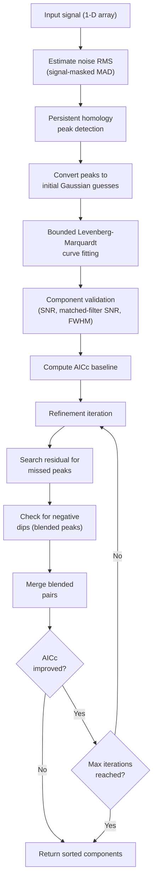

# Algorithm Overview

Refinement always runs after the initial fit. Each refinement step (residual peak addition, negative-dip splitting, blended-pair merging) is accepted only if it improves the corrected Akaike Information Criterion (AICc). This prevents over-fitting while allowing the model to recover missed structure.

## Step 1: Noise estimation

The noise level $\sigma_\mathrm{rms}$ is estimated using a signal-masked MAD estimator (Riener et al. 2019, Sect 3.1.1). Runs of consecutive positive channels longer than 2 are masked (with padding), the MAD is computed from negative unmasked channels, outliers are clipped at $5\sigma$, and the final RMS is computed from surviving channels.

## Step 2: Peak detection

Peaks are detected via 0-dimensional persistent homology using a descending upper-level set filtration. A union-find structure tracks connected components as the threshold descends from the global maximum. Each peak is assigned a **persistence** value (birth $-$ death), representing how significant the peak is relative to its neighbours.

Peaks with persistence below $\beta \cdot \sigma_\mathrm{rms}$ are discarded. The surviving peaks become initial guesses for Gaussian components, with the stddev estimated from the peak-to-saddle distance.

## Step 3: Curve fitting

Initial guesses are refined via bounded Levenberg-Marquardt optimisation. When the C extension is available, it uses a custom solver compiled from `_gaussfit.c`. Otherwise it falls back to SciPy's `curve_fit`. Bounds constrain amplitudes to be positive, means to lie within the spectrum, and stddevs to be at least 0.3 channels.

## Step 4: Component validation

Fitted components are checked against quality criteria:

- **FWHM** must be $\geq$ 1 channel (no sub-channel features)
- **Mean** must lie within `[0, n_channels)`
- **Amplitude SNR** must exceed `snr_min` (default 1.5)
- **Matched-filter SNR** must exceed `mf_snr_min` (default 5.0):

$$
\mathrm{SNR}_\mathrm{mf} = \frac{A}{\sigma_\mathrm{rms}} \sqrt{\sigma} \; \pi^{1/4}
$$

Narrow peaks must have proportionally higher amplitude to pass this filter.

## Step 5: Iterative refinement

Up to `max_refine_iter` iterations (default 3), the algorithm attempts three operations:

1. **Residual peak search** -- run persistence-based peak detection on the residual (data $-$ model) to find missed components.
2. **Negative-dip splitting** -- if the residual has a deep negative dip ($> 5\sigma_\mathrm{rms}$), split the broadest overlapping component into two.
3. **Blended-pair merging** -- if two components have means closer than $f_\mathrm{sep} \cdot \min(\mathrm{FWHM}_i, \mathrm{FWHM}_j)$, merge them into one.

After each operation, the model is refit and AICc is recomputed. The change is accepted only if AICc decreases. If no operation improves AICc, refinement stops early.
