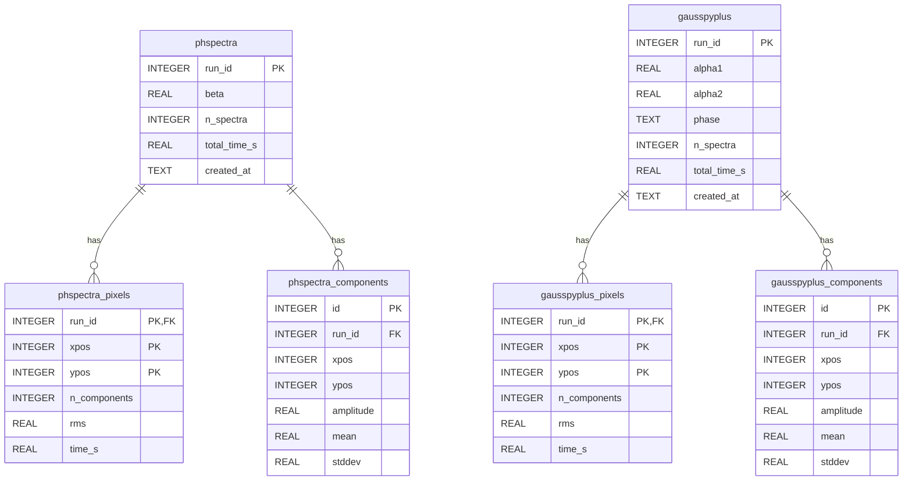

# Reproducing results

All benchmarks are run through the `benchmarks` CLI. To get started, run:

```bash
uv run benchmarks --help
```

This will show you all available commands. Each command is documented with `--help` and the source code is available in `packages/benchmarks/src/benchmarks/commands/`. The commands are designed to be modular, e.g.

```
uv run benchmarks download --help
```

will show you how to download the data.

## Step 0: Download data

```bash
uv run benchmarks download
```

Downloads and caches the [GRS test field FITS cube](https://github.com/mriener/gausspyplus/raw/master/gausspyplus/data/grs-test_field.fits) from the [GaussPy+ repository](https://github.com/mriener/gausspyplus) ([Riener et al. 2019](https://doi.org/10.1051/0004-6361/201935519)). The cube covers a $60 \times 20$ pixel region with ~670 velocity channels (~4 MB). See [Data Sources](../idea-and-plan/data-sources#gausspy-test-field) for details. The GaussPy+ decompositions take a long time to run, so this only needs to be done once.

The pre-computed data is stored in [SQLite](https://www.sqlite.org/index.html) format. This is the schema of that database:



The database contains fits for the sample field using both PHSpectra and GaussPy+. Each run is stored with its parameters, timing, and per-pixel/component details. This allows for flexible querying and analysis without needing to re-run the decompositions. I also re-ran GaussPy+ using a Docker container to get accurate timing data for the comparison, which is stored in the same format.

## Step 1: Fitting everything again

If you are playing with the code and want to run the decompositions yourself, you can do so with:

```bash
uv run benchmarks pre-compute
```

that will run both PHSpectra and GaussPy+ on the full GRS test field (4200 spectra) and save the results to the SQLite database in a new run, it will persist all your runs. This is a long-running process (expect ~20 min) but it will give you the most up-to-date results if you have made changes to the fitting code. You can also specify `--n-spectra` to run on a smaller subset for testing.

If you are interesting in loooking into one specific pixel, you can use also add it to the command:

```bash
uv run benchmarks pre-compute --extra-pixels 31,40 --n-spectra 100
```

## Step 2: GaussPy+ comparison

Plots can be generated from the saved data without needing to re-run the decompositions,

```bash
uv run benchmarks compare-plot # plots in the accuracy section
uv run benchmarks ncomp-rms-plot # n_components vs RMS
uv run benchmarks performance-plot # timing histogram
```

## Step 3: Training data

I also included a training tool for adding human detections in specific pixels. You can run it with

```
uv run train-gui
```

This is a simple interactive tool that shows you the spectrum at a given pixel and allows you to click to add Gaussian components. The resulting training data is saved in a JSON file that can be used for training the beta parameter of PHSpectra. See `train_beta.py` for details on how the training data is used.

## Additional commands

### Inspect a single pixel

```bash
uv run benchmarks inspect PX PY
```

Shows data + GaussPy+ + PHSpectra at multiple ($\beta$, $\mathrm{MF}_{\min}$) combinations for one pixel.

### Persistence Homology visuals

```bash
uv run benchmarks persistence-plot
```

Generates plots used to explain the concept of persistence homology in the documentation, showing the birth/death of features as the water level changes.

### Generate logo

```bash
uv run benchmarks generate-logo
```

Generates the `logo.svg` and `favicon.svg` files used in the documentation header. This is a fun little command that creates a synthetic spectrum with annotated persistence homology features, demonstrating the core concept of PHSpectra in a visually appealing way. The generated SVGs are idempotent (only updated if the content changes) to avoid unnecessary file modifications.
